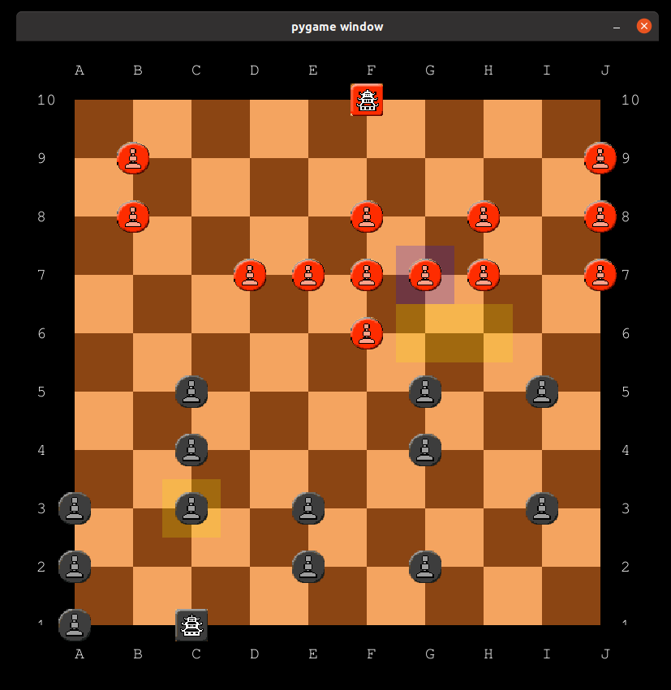
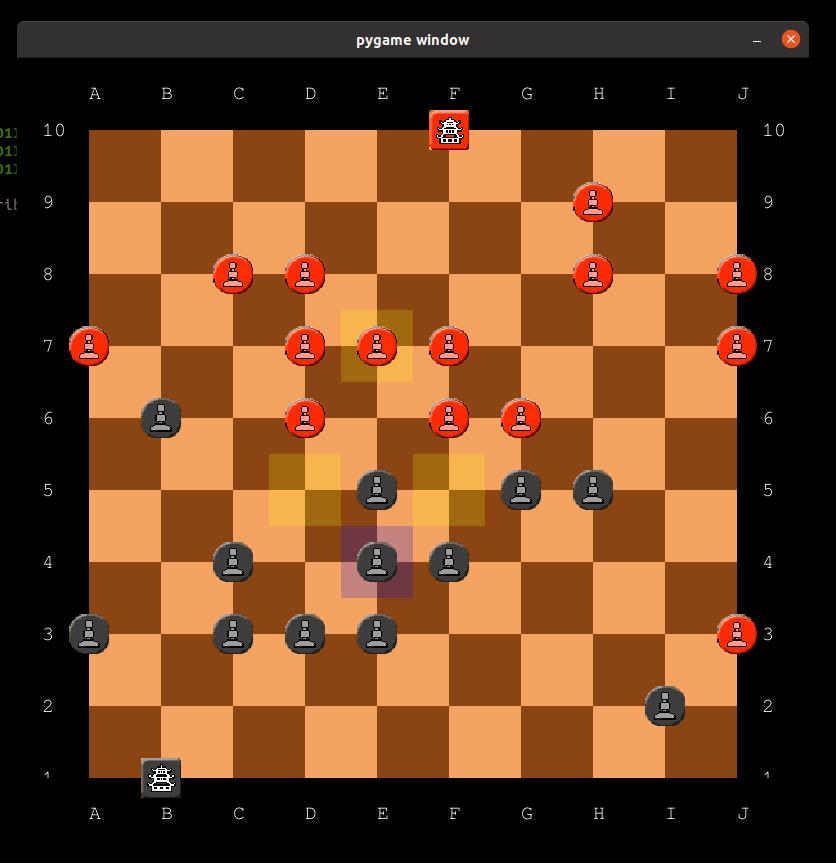

# Cannon game

This is a game GUI engine for Cannon board game developed using Python and pygame.
Cannon is a two-player board game invented in 2003 by David E. Whitcher.
Rules are available [here](https://www.iggamecenter.com/info/en/cannon.html).

The implemented GUI allows to play for two human players, for one human player and one AI player, and for two AI players. Visuals are shown below:
|   |   |

This game engine contains a various number of AI implementations to play against a human player.
Following AI engines with enhancement were developed:
* Random player AI
* Vanilla MiniMax
* Vanilla NegaMax
* MiniMax with Alpha Beta pruning
* NegaMax with Alpha Beta pruning
* Transposition table for alpha beta algorithm using Zobrist hasing
* Variable depth search with time constraints

## Requirements

```
pip3 install pygame
```

## Start the game

```
python3 CannonMain.py
```

## Choose player role

If you want choose for human or AI to play for the red or black, assign according boolean in `CannonMain.py` on lines 29-33.


## Change AI algorithms

Choose desired AI algorithm, by uncommenting it on lines 109-115 in `CannonMain.py`.
You can change the maximum depth by changin `maxDepth` variable.
You can also change maximum search time for the iterative deepering search by changing `maxTime` variable.
